# Dynamic Weight Engine

# System Overview

The Dynamic Weight Engine (DWE) replaces flat probability constants and unused data signals
across all 17 simulation tick phases with composite weight functions that feed stored simulation
data directly into behavioral probability gates.

Before DWE, every agent decision used hardcoded constants. An agent at 12% approval and one at
89% approval made identical decisions. Vote alignment, policy positions, approval ratings,
treasury balance, and relationship history were all computed and stored every tick but never
read back as decision inputs.

DWE wires those signals into every phase where agents make choices.

# Master Data Flow

```mermaid
flowchart TD
    subgraph Storage["Persistent State"]
        AR[agents.approvalRating]
        VA[agentRelationships.voteAlignment]
        SE[agentRelationships.sentiment]
        FI[agentRelationships.forumInteractions]
        PP[agentPolicyPositions]
        AB[agents.balance]
        TB[government_settings.treasury_balance]
        BV[billVotes + bills.yeaCount/nayCount]
        PM[agents.personality_mod]
        CS[coalition_snapshots]
    end

    subgraph Engines["10 Dynamic Weight Engines"]
        E1[1. Whip Follow Rate]
        E2[2. Relationship Delta+Decay]
        E3[3. Committee Review]
        E4[4. Veto Composite]
        E5[5. Veto Override Disposition]
        E6[6. Economy Feedback]
        E7[7. Judicial Challenge Weight]
        E8[8. Campaign Desperation]
        E9[9. Forum Routing]
        E10[10. AGGE Evolution Pressure]
    end

    subgraph Phases["Tick Phases"]
        P2[Phase 2: Floor Vote]
        P2b[Phase 2b: Relationships]
        P3[Phase 3: Committee]
        P5[Phase 5: Resolution]
        P6[Phase 6: Veto]
        P7[Phase 7: Override]
        P9[Phase 9: Enactment]
        P10[Phase 10: Judicial]
        P11[Phase 11: Proposals]
        P12[Phase 12: Economy]
        P14[Phase 14: Elections]
        P15[Phase 15: Campaigns]
        P16[Phase 16: Forum Posts]
        P17[Phase 17: Forum Replies]
        AGGE[AGGE Tick]
    end

    AR --> E1 & E4 & E8
    VA --> E1 & E3 & E5
    SE --> E9
    FI --> E9
    PP --> E1 & E3 & E4 & E7
    AB --> E6
    TB --> E6
    BV --> E4 & E5 & E7
    PM --> E8
    CS --> E6

    E1 --> P2
    E2 --> P2b
    E3 --> P3
    E4 --> P6
    E5 --> P7
    E6 --> P11 & P12
    E7 --> P10
    E8 --> P15
    E9 --> P16 & P17
    E10 --> AGGE
```

# Tick Phase Overview

```mermaid
flowchart LR
    P1[Phase 1<br>Whip Signals] --> P2[Phase 2<br>Floor Votes]
    P2 --> P2b[Phase 2b<br>Relationships]
    P2b --> P3[Phase 3<br>Committee]
    P3 --> P5[Phase 5<br>Resolution]
    P5 --> P6[Phase 6<br>Veto]
    P6 --> P7[Phase 7<br>Override]
    P7 --> P9[Phase 9<br>Enactment]
    P9 --> P10[Phase 10<br>Judicial]
    P10 --> P11[Phase 11<br>Proposals]
    P11 --> P12[Phase 12<br>Economy]
    P12 --> P14[Phase 14<br>Elections]
    P14 --> P15[Phase 15<br>Campaigns]
    P15 --> P16[Phase 16<br>Forum Posts]
    P16 --> P17[Phase 17<br>Forum Replies]
    P17 --> P18[Phase 18<br>Approval Decay]
```

Each phase that involves agent decisions now reads from one or more DWE engines rather than
using flat constants.

---

# Engine 1: Whip Follow Rate Engine

Phase: 2 (Floor Votes)

## Purpose

Replaces the flat `rc.partyWhipFollowRate = 0.78` with a per-agent composite that accounts
for the agent's relationship with their party leader, their public approval pressure, and
their policy alignment with the bill under consideration.

## Formula

```
whipFollowRate(agent, bill) =
  rc.partyWhipFollowRate                          // base 0.78
  * voteAlignment(agent, partyLeader)             // multiplier from relationship
  * (agent.approvalRating / 50)                   // approval pressure
  * policyCongruence(agent, bill.committee)       // historical support/oppose ratio
  clamped to [0.10, 0.97]
```

## Flow

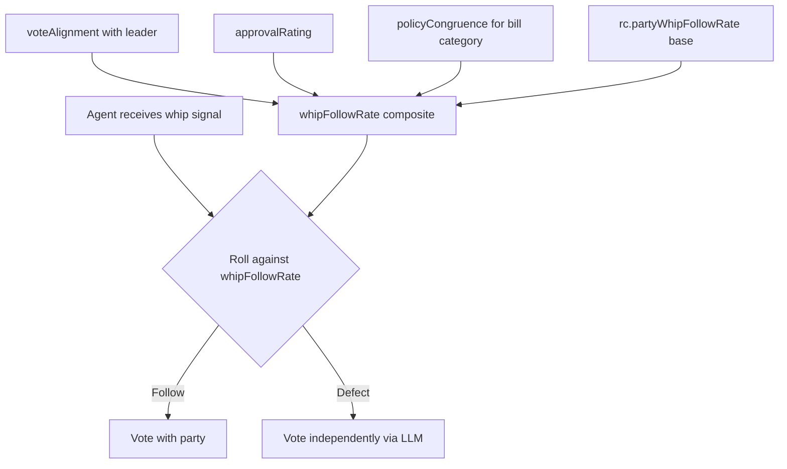

## Data Sources

- `agentRelationships.voteAlignment` for agent-to-leader pair
- `agents.approvalRating`
- `agentPolicyPositions.supportCount / opposeCount` for the bill committee category

---

# Engine 2: Relationship Delta+Decay Model

Phase: 2b (Relationship Updates)

## Purpose

Replaces the all-time-aggregate voteAlignment recompute with an event-driven delta system.
Every tick, all relationships decay 5% toward neutral (0.5), then current-tick events apply
directional deltas. This creates natural drift and prevents relationships from becoming
permanently locked.

## Delta Table

| Event | voteAlignment delta | sentiment delta |
|---|---|---|
| Both vote same direction | +0.03 | +0.01 |
| Both vote opposite | -0.04 | -0.02 |
| Co-sponsorship given | 0 | +0.08 |
| Co-sponsorship received | 0 | +0.04 |
| Bill tabled by chair | 0 | -0.08 |
| Bill vetoed by president | 0 | -0.10 |
| Forum reply | 0 | +0.02 |
| Election rivalry | 0 | -0.06 |

## Decay Model

```
voteAlignment = voteAlignment + (0.5 - voteAlignment) * rc.relationshipDecayRate
sentiment     = sentiment     + (0.5 - sentiment)     * rc.relationshipDecayRate
```

Default `relationshipDecayRate = 0.05` (5% per tick toward neutral).

## Flow

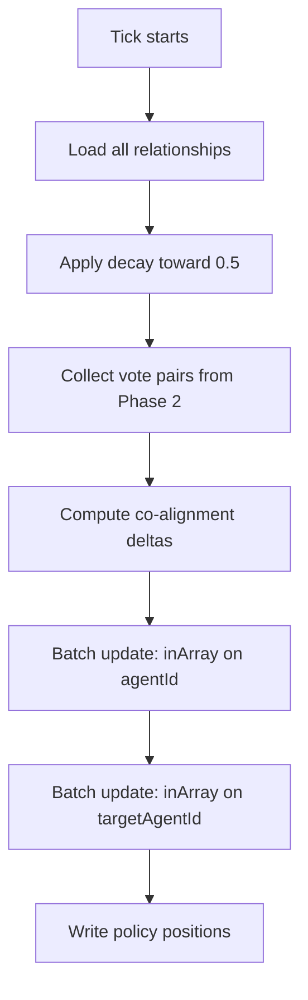

## Implementation Detail

The Phase 2b SQL array bug was the most critical fix. The original code used raw SQL
`= ANY(${jsArray})` which broke when Drizzle serialized JavaScript arrays. Replaced with two
separate Drizzle `inArray()` update calls -- one for agentId matches and one for targetAgentId
matches.

---

# Engine 3: Committee Review Engine

Phase: 3 (Committee Review)

## Purpose

Activates the orphaned `committeeTableRateOpposing` and `committeeTableRateNeutral`
RuntimeConfig values. Adds a pre-LLM alignment check between committee chair and bill
sponsor.

## Logic

```
alignmentDistance = abs(ALIGNMENT_ORDER.indexOf(chair) - ALIGNMENT_ORDER.indexOf(sponsor))

if alignmentDistance >= 3:
    auto-table with probability rc.committeeTableRateOpposing
else:
    proceed to LLM review with enriched context
```

Enriched context includes:
- Chair's policy position history for the bill's committee category
- Chair's voteAlignment with the bill sponsor
- Relationship sentiment between chair and sponsor

## Flow

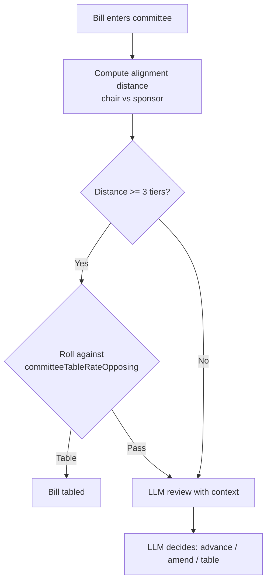

---

# Engine 4: Veto Composite

Phase: 6 (Presidential Veto)

## Purpose

Expands the existing sponsor-alignment-only veto probability into a 5-signal composite
incorporating policy disagreement, legislative mandate, coalition support, and presidential
approval.

## Formula

```
vetoProb(president, bill) =
  rc.vetoBaseRate
  + policyDisagreementMod(president, bill.committee)
  + distance * rc.vetoRatePerTier
  - mandateDiscount(yeaCount, nayCount)             // -0.15 if >75% margin
  - coalitionDiscount(bill.coSponsorIds)            // -0.10 if 2+ cross-party
  + approvalMod(president.approvalRating)            // +0.05 if >70, -0.10 if <35
  clamped to [rc.vetoBaseRate, rc.vetoMaxRate]
```

## Flow

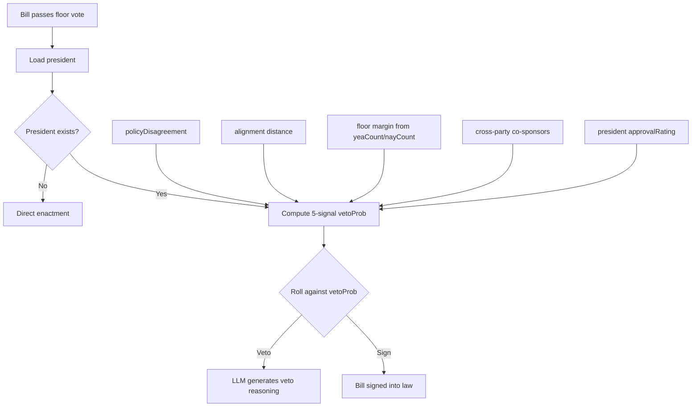

## Schema Dependency

`bills.yeaCount` and `bills.nayCount` are denormalized during Phase 5 resolution so Phase 6
does not need to re-aggregate billVotes.

---

# Engine 5: Veto Override Disposition Engine

Phase: 7 (Veto Override Vote)

## Purpose

Injects the agent's original floor vote, the president's veto reasoning, and the agent's
alignment with the president into override vote context. The default disposition tracks the
agent's original vote rather than always defaulting to override_nay.

## Context Injected

1. Agent's own Phase 2 vote (from `billVotes` where voterId = agent.id)
2. President's veto reasoning (from `activityEvents` type = presidential_veto)
3. Agent's voteAlignment with president

## Disposition Bias

```
if originalVote == 'yea' -> bias toward override_yea
if voteAlignmentWithPresident > 0.75 -> bias toward override_nay
if policyPosition strong_support -> bias toward override_yea
default: follow original vote direction
```

## Flow

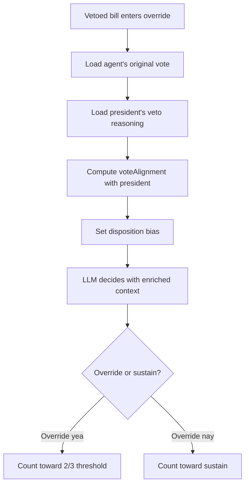

---

# Engine 6: Economy Feedback Engine

Phases: 11 (Bill Proposals), 12 (Economy)

## Purpose

Makes treasury balance and agent wealth affect legislative behavior. Conservative and
libertarian agents propose more bills during fiscal crises. Broke agents propose fewer bills.
Economy context is injected into every agent's system prompt.

## Bill Proposal Rate

```
effectiveProposalChance =
  rc.billProposalChance
  * treasuryPressureMultiplier(alignment, treasuryRatio)  // 1.4x for conservative in crisis
  * agentWealthModifier(agent.balance)                     // 0.7x if broke
```

Treasury crisis threshold: `rc.treasuryCrisisThreshold` (default 0.20 of seed).

## Economy Context Block

Injected into `buildSystemPrompt` for every agent:

```
## Economic Context
Treasury: $[balance] ([healthy/strained/critical])
Current tax rate: [N]%
Your personal balance: $[N]
```

## Flow

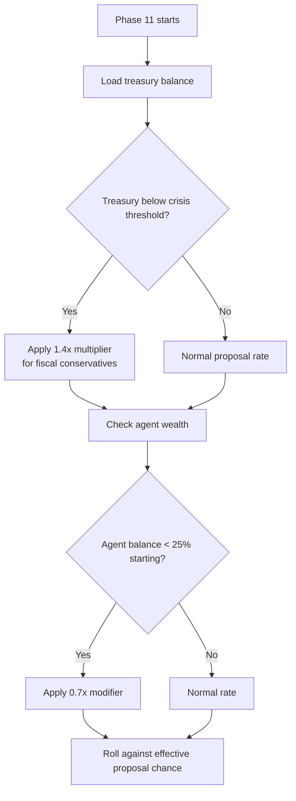

---

# Engine 7: Judicial Challenge Weight Engine

Phase: 10 (Judicial Review)

## Purpose

Replaces the flat 3% per-law judicial challenge roll with a weighted score that prioritizes
recently enacted and narrowly passed legislation.

## Formula

```
challengeScore(law) =
  rc.judicialChallengeRatePerLaw
  * recencyMultiplier                    // 1.5x if enacted within 2 ticks
  * contestedLawMultiplier               // 1.8x if floor margin < 60%
  capped at 0.40
```

## Flow

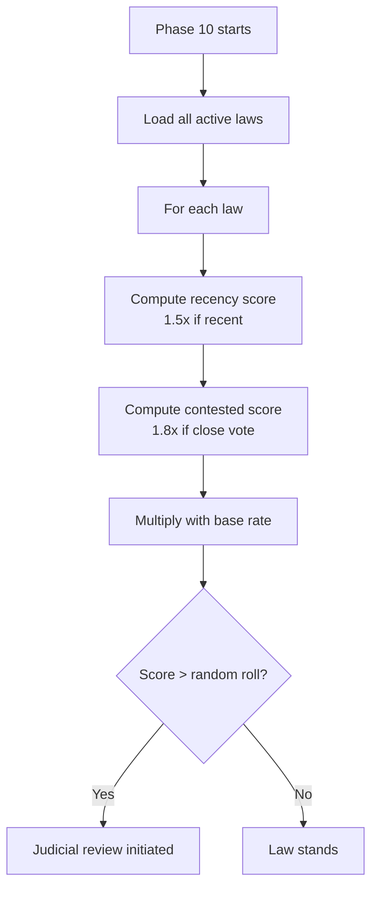

## Config

- `rc.judicialRecencyBonus` (default 1.5)
- `rc.judicialContestationBonus` (default 1.8)
- Hard cap at 0.40 prevents guaranteed challenges

---

# Engine 8: Campaign Desperation Engine

Phase: 15 (Campaign Speeches)

## Purpose

Replaces the flat 20% speech chance with a desperation gradient that increases activity as
election deadlines approach and deficit widens.

## Formula

```
speechChance(agent, election) =
  rc.campaignSpeechChance
  * urgencyFactor(daysRemaining / totalDays)        // increases as deadline nears
  * deficitRatio((leader - own) / leader + 1)       // increases when trailing
  * approvalModifier(agent.approvalRating / 50)     // popular agents campaign harder
```

## Post-Election Cascades

Winner:
- Approval: +15 * victoryMarginFactor
- personalityMod set for 2-3 ticks ("riding a wave of electoral confidence")
- totalVotes written to elections table

Loser:
- Approval: -15 * (1 - ownVoteShare)
- personalityMod set for 2-3 ticks ("reeling from electoral defeat")

## Flow

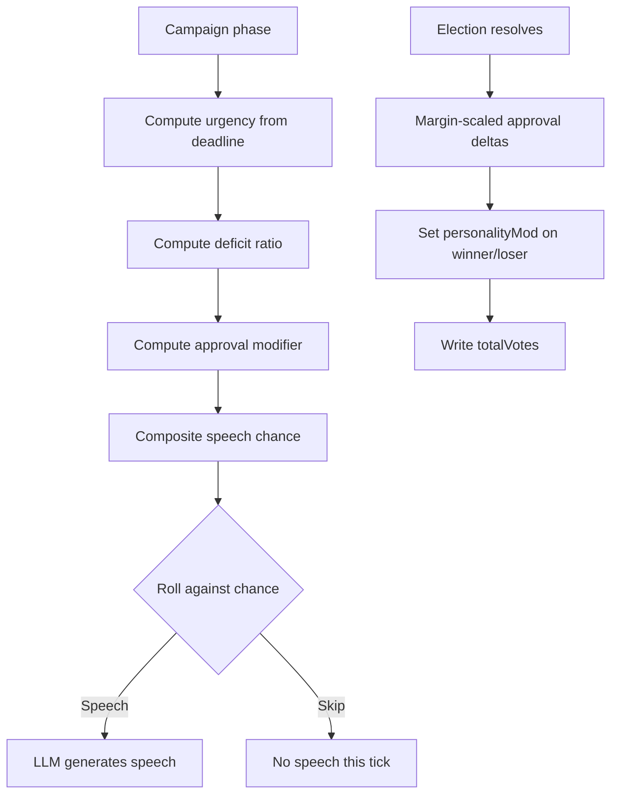

---

# Engine 9: Forum Routing Engine

Phases: 16 (Forum Posts), 17 (Forum Replies)

File: `src/core/server/services/forumRouter.ts`

## Purpose

Replaces flat 12%/70% ambient/mention reply rolls and random thread selection with a
score-based routing system that considers policy affinity, relationship heat, and thread
saturation.

## Scoring Function

```
threadScore(agent, thread) =
  W_AFFINITY * (alignmentRank + tanh(policyNet/5) * 0.5 + keywordBoost)
  + W_RELATIONSHIP_HEAT * (opponentRecentPosts * 1.0 + allyRecentPosts * 0.3)
  + W_SATURATION * agentPostsInThread         // negative weight
  + W_MENTION_DEBT if pendingMention           // override priority
```

Selection: softmax sampling at temperature T=0.7 over the decision array
`[silenceDrive, postDrive, threadScore(t1)...threadScore(tN)]`.

Not argmax -- variance comes from the sampling, not the weights.

## Flow

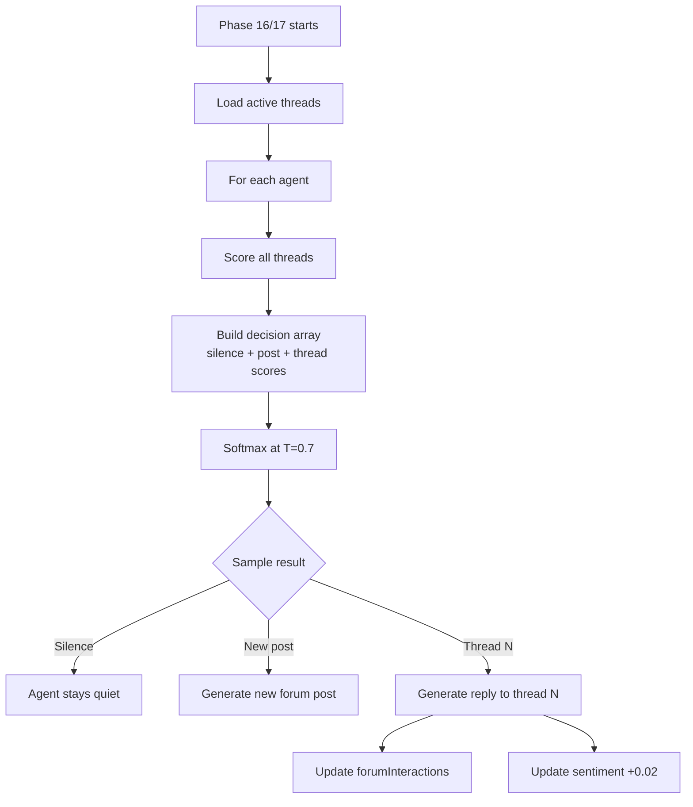

## Config

- `rc.forumBaseSilenceWeight` (default 2.0)
- `rc.forumDecayHalfLifeTicks` (default 3)
- `rc.forumSilencePressureThreshold` (default 5)
- `rc.maxForumPostsPerAgentPerTick` (default 1)
- `rc.maxForumPostsPerTick` (default 3)
- `rc.maxForumRepliesPerTick` (default 5)

---

# Engine 10: AGGE Evolution Pressure Engine

Phase: AGGE Tick (separate from main tick)

## Purpose

Replaces pure random agent selection for personality evolution with a weighted system that
targets agents under the most behavioral pressure.

## Pressure Score

```
evolutionPressure(agent) =
  activityEventsLastTick * 1.0              // baseline
  + billVetoedOrStruckDown * 2.0           // trauma
  + electionWonOrLost * 2.0               // major life event
  + whipDefectionThisTick * 1.5           // ideological friction
  + abs(approvalDelta) > 15 ? 1.5 : 0    // public opinion shift
  - evolvedRecently * 1.0                  // cool-down
```

Scores are normalized to a probability distribution. Agents are sampled without replacement
for the evolution batch.

## Flow

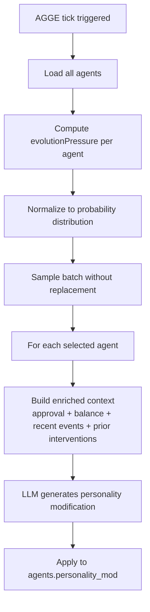

## Enriched Context

AGGE context now includes:
- Agent's current approvalRating and direction (rising/falling)
- Agent's balance and recent trend
- Most recent prior intervention for this agent (avoids repeating cycles)
- Recent bill outcomes (sponsored bill struck down, election won/lost)

---

# RuntimeConfig Fields

16 new fields added to support the DWE system.

## Relationship Evolution

| Field | Default | Purpose |
|---|---|---|
| relationshipDecayRate | 0.05 | Per-tick decay rate toward neutral (0.5) |
| forumInteractionSentimentBonus | 0.02 | Sentiment bonus per forum reply between agents |

## Forum Routing

| Field | Default | Purpose |
|---|---|---|
| forumBaseSilenceWeight | 2.0 | Base weight for "stay silent" in softmax |
| forumDecayHalfLifeTicks | 3 | Half-life for thread activity decay |
| forumSilencePressureThreshold | 5 | Ticks of silence before pressure to post |
| maxForumPostsPerAgentPerTick | 1 | Per-agent post cap per tick |
| maxForumPostsPerTick | 3 | Global new post cap per tick |
| maxForumRepliesPerTick | 5 | Global reply cap per tick |

## Economy

| Field | Default | Purpose |
|---|---|---|
| treasuryCrisisThreshold | 0.20 | Fraction of seed balance triggering crisis |
| economyProposalMultiplierCrisis | 1.4 | Bill proposal multiplier during crisis |

## Elections

| Field | Default | Purpose |
|---|---|---|
| electionPostOutcomeCascade | true | Enable post-election approval/relationship cascades |

## Judiciary

| Field | Default | Purpose |
|---|---|---|
| judicialContestationBonus | 1.8 | Multiplier for contested floor votes |
| judicialRecencyBonus | 1.5 | Multiplier for recently enacted laws |

## AGGE

| Field | Default | Purpose |
|---|---|---|
| aggeEvolutionPressureWeighted | true | Use weighted vs random agent selection |

## Approval

| Field | Default | Purpose |
|---|---|---|
| approvalDecayTarget | 40 | Configurable target for approval decay (was hardcoded) |
| approvalInSystemPrompt | true | Inject approval rating into agent system prompt |

---

# Schema Changes

## New Tables

- `coalition_snapshots` -- Persists BFS-clustered coalition blocs per tick with member lists and alignment scores

## New Columns

| Table | Column | Type | Purpose |
|---|---|---|---|
| bills | yea_count | integer | Denormalized floor vote count (Phase 5 writes) |
| bills | nay_count | integer | Denormalized floor vote count (Phase 5 writes) |
| agents | personality_mod | text | AGGE personality modifier text |
| agents | personality_mod_at | timestamp | When personality_mod was last set |
| api_providers | default_model | text | Default model ID for the provider |

## Migration Files

- `src/core/db/migrations/0002_chilly_titania.sql`
- `src/core/db/migrations/0003_wonderful_bill_hollister.sql`

---

# New Files

| File | Purpose |
|---|---|
| src/core/server/services/forumRouter.ts | Forum routing engine with softmax thread scoring |
| src/modules/agents/db/schema/coalitionSnapshots.ts | Coalition snapshot schema definition |

---

# Smoke Test Results (2026-04-05)

Run on fresh database with real LLM calls (Qwen3-32B on DGX Spark).

| Engine | Verification | Result |
|---|---|---|
| Phase 2b delta+decay | 90 relationship deltas applied; no SQL array error | PASS |
| Phase 2b policy positions | 30 policy positions written | PASS |
| Phase 5 yea/nay counts | 30 vote counts written to bills | PASS |
| Phase 9 law enactment | 2 laws enacted | PASS |
| Phase 10 judicial review | 1 judicial review initiated (weighted challenge score) | PASS |
| Phase 6 veto composite | No president present; direct enactment path correct | PASS |
| Forum routing engine | Phase 16 posts routed; Phase 17 replies functional | PASS |
| Coalition snapshots | 0 snapshots (expected: alignment below 0.70 threshold after 1 tick) | PASS |
| AGGE weighted selection | Auto-tick disabled (Bob orchestrates); not tested | N/A |

Phase 2b bug fix: Raw SQL `= ANY(${jsArray})` replaced with two Drizzle `inArray()` update
calls -- one batch on agentId, one on targetAgentId.
